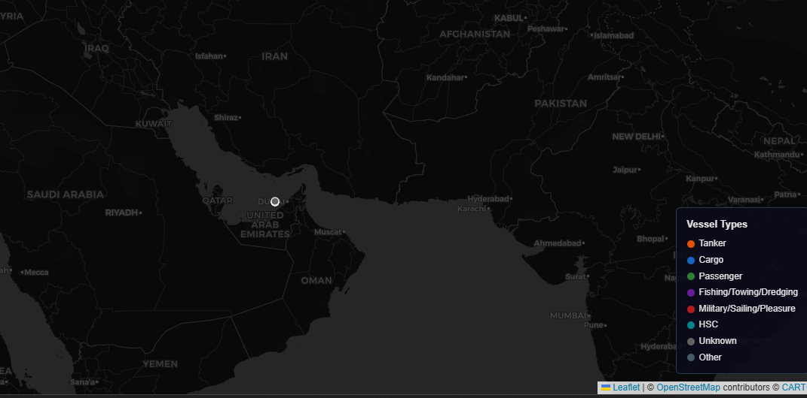

# Strait of Hormuz — Live Ship Tracker

Real-time vessel tracking in the Strait of Hormuz using AIS (Automatic Identification System) data.



## Architecture

```
aisstream.io (WebSocket) → Raspberry Pi 5 → SQLite → FastAPI + Leaflet.js
```

- **Data Source**: [aisstream.io](https://aisstream.io/) — free, real-time global AIS stream
- **Collection**: Python WebSocket client, filtered to Strait of Hormuz bounding box
- **Storage**: SQLite (lightweight, no external DB needed)
- **Visualization**: Leaflet.js dark map with vessel type color coding, track history, auto-refresh

## Features

- Real-time vessel positions updated every 30 seconds
- Color-coded by vessel type (Tanker, Cargo, Passenger, Military, etc.)
- Click any vessel to see name, speed, course, destination, flag, and size
- Track history visualization (6-hour trail per vessel)
- Statistics dashboard (active vessels, total records, type breakdown)
- Runs 24/7 on Raspberry Pi 5 with Docker

## Quick Start

```bash
# Clone
git clone https://github.com/yasumorishima/hormuz-ship-tracker.git
cd hormuz-ship-tracker

# Set API key
cp .env.example .env
# Edit .env and add your aisstream.io API key

# Run
docker compose up -d

# Open http://localhost:8002
```

## API Endpoints

| Endpoint | Description |
|---|---|
| `GET /` | Live map UI |
| `GET /api/latest` | Latest position per vessel (last 30 min) |
| `GET /api/tracks/{mmsi}?hours=6` | Position history for a vessel |
| `GET /api/stats` | Active vessels count, type breakdown |

## Tech Stack

- Python 3.12 / FastAPI / uvicorn
- WebSocket (aisstream.io)
- SQLite (aiosqlite)
- Leaflet.js + CARTO dark tiles
- Docker on Raspberry Pi 5

## Data Source

Ship position data is provided by [aisstream.io](https://aisstream.io/) via their free WebSocket API.
AIS (Automatic Identification System) is a maritime safety system that broadcasts vessel position, speed, course, and identification.

## License

MIT
