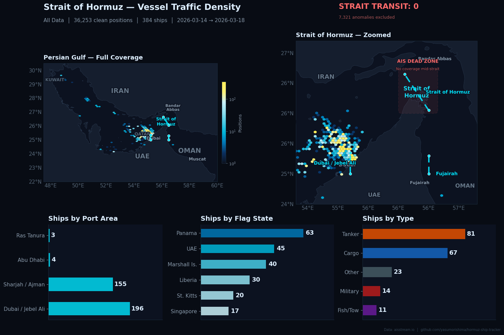
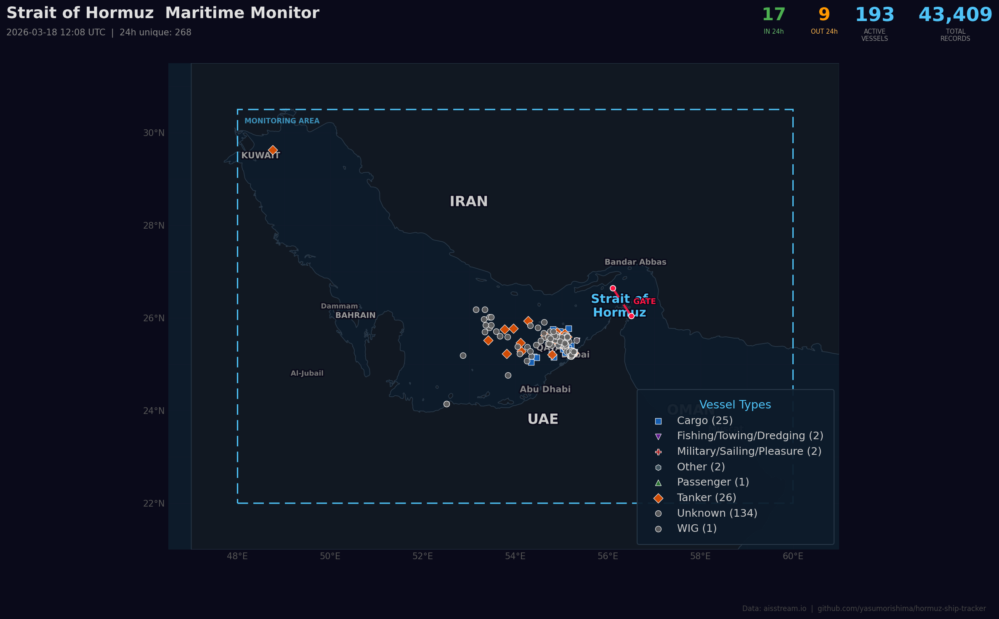
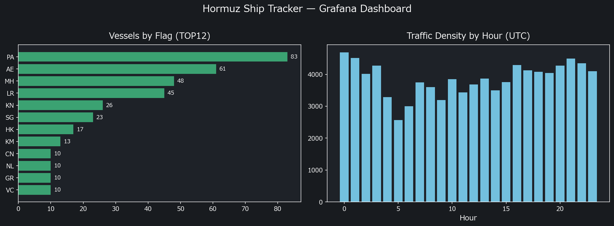
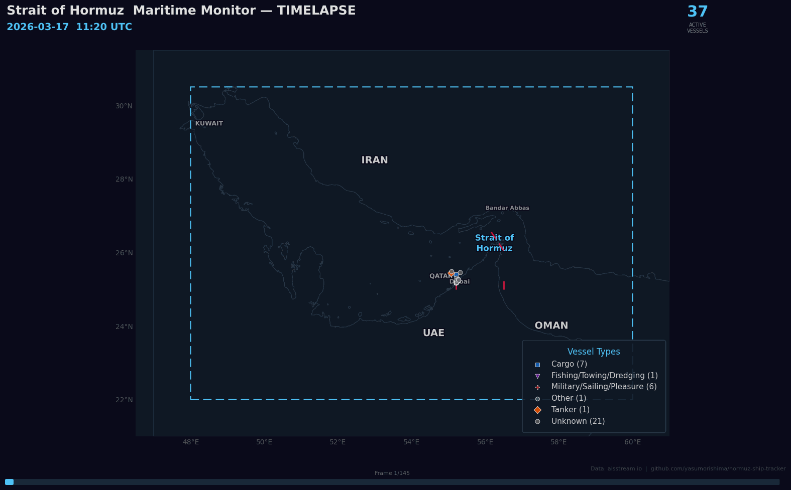
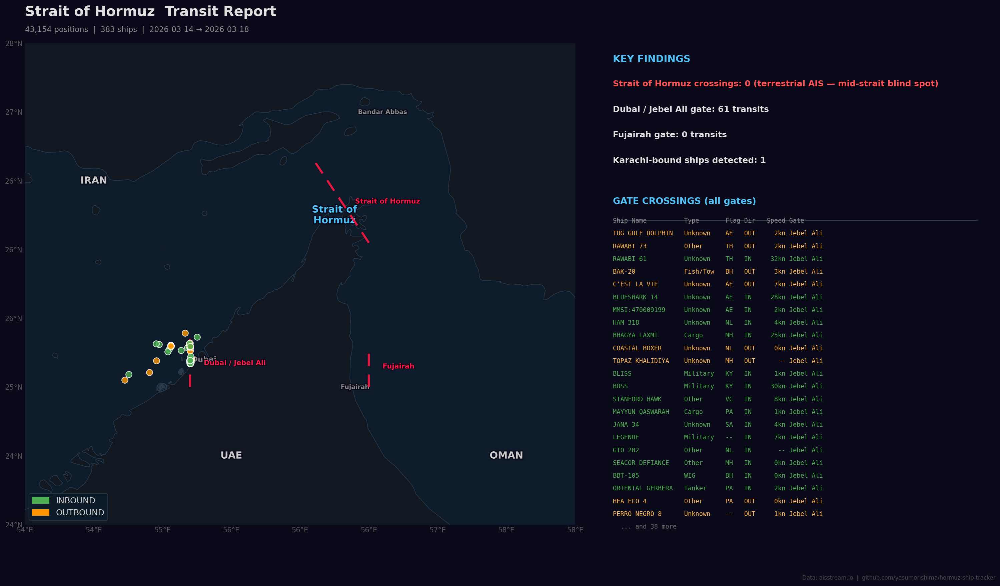

# Strait of Hormuz — Maritime Monitor

Real-time vessel tracking and maritime intelligence for the Persian Gulf, Strait of Hormuz, and Gulf of Oman.
Monitors shipping patterns 24/7 using AIS data on Raspberry Pi 5, with automated transit detection, vessel state classification, data quality analysis, and visualization tools.



### At a Glance

| Positions | Vessels | Strait Transit | Top Port | Top Flag | Top Type |
|---:|---:|---:|---|---|---|
| 43,000+ | 384 | **0** | Dubai / Jebel Ali (196) | Panama (63) | Tanker (81) |

**[View full statistics →](docs/STATS.md)** — daily breakdown, hourly traffic pattern, top ships, flag states, destinations *(auto-updated every 6h)*

### Latest Snapshot (auto-updated every 6 hours)



## Key Findings

- **0 confirmed Strait of Hormuz crossings** — no vessel was detected transiting through the strait gate line
- **AIS dead zone mid-strait** — terrestrial AIS receivers on shore cannot cover the ~35 nm wide strait center; ships crossing are invisible without satellite AIS
- **~17% of AIS data is anomalous** — speed 102.3 kn (protocol "not available" sentinel) and 40-99 kn (receiver glitches) produce false position jumps
- **Dubai / Jebel Ali dominates traffic** — 196 unique ships detected near the port, with Panama (63), UAE (45), and Marshall Islands (40) as top flag states
- **Tankers (81) and cargo (67)** are the most common vessel types
- **Karachi-bound traffic detected** — at least 1 vessel (CSTAR VOYAGER) bound for Pakistan observed in the western Gulf

## What This Monitors

- **Strait transit rate** — virtual gate lines detect vessels entering/leaving the Persian Gulf and major ports
- **Vessel state** — anchored, maneuvering, transiting (speed-based + geofence classification)
- **Anchorage congestion** — 11 named zones (Fujairah, Dubai, Bandar Abbas, etc.) with vessel counts
- **Waiting fleet** — vessels stationary for 6h+ / 24h+ (indicates disruption)
- **Flag state & destination analysis** — MMSI-based country detection, AIS destination normalization
- **Situation assessment** — data-driven status: NO TRANSIT / LIMITED / ACTIVE
- **AIS data quality** — anomaly classification, false transit filtering, known glitch source tracking

## Architecture

```
aisstream.io (WebSocket)
  → Land Filter (Natural Earth 10m + Shapely)
  → Batch INSERT (5-sec flush, 2-min per-vessel throttle)
  → SQLite (positions, transit_events, analytics_state)
  → Analytics Engine (5-min cycle)
      ├─ Multi-gate transit detection (3 gates)
      ├─ Vessel state classification
      ├─ AIS anomaly filtering (speed >= 40 kn rejected)
      └─ Transit deduplication (6-hour window)
  → FastAPI Server (port 8002)
      ├─ Live dashboard (Leaflet.js + Chart.js)
      ├─ Animated replay (/replay)
      ├─ 18 REST API endpoints
      └─ Data quality API
  → Visualization generators
      ├─ Heatmap (hexbin, 3-panel infographic)
      ├─ Timelapse GIF (interpolated movement)
      ├─ Transit report (map + table)
      └─ Auto-snapshot → GitHub (every 6h)
```

## Grafana Dashboard

[Hormuz Ship Tracker](https://yasumorishima.grafana.net/public-dashboards/f026a54edf9f476cbec9f6cde9d66362) — Daily transit trends, flag-country breakdown, hourly traffic density. Connected to BigQuery `data-platform-490901.hormuz`.



## Visualization Tools

### Traffic Density Heatmap (`src/heatmap.py`)
3-panel layout: full Gulf hexbin + zoomed strait with AIS dead zone + infographic bars (ports, flags, ship types). Anomalous positions pre-filtered. **Auto-updated every 6 hours.**

```bash
docker exec hormuz-tracker python3 src/heatmap.py --hours 0 --filename heatmap.png
```

### Timelapse GIF (`src/timelapse.py`)
Animated GIF with smooth interpolated vessel movement, trails, and transit counters. Land-aware interpolation prevents ships from crossing peninsulas.



```bash
docker exec hormuz-tracker python3 src/timelapse.py --hours 24 --interval 10 --trail 90 --fps 10
```

### Transit Report (`src/transit_report.py`)
Map + table showing gate crossings with ship details (name, type, flag, speed, destination), plus Karachi-bound vessel tracking.



### Animated Replay (`/replay`)
Browser-based Leaflet.js playback with play/pause, speed control (0.25x–16x), timeline scrubbing, and transit ship panel. Keyboard shortcuts: Space (play), arrows (step), +/- (speed).

## AIS Data Quality

This project explicitly tracks and annotates AIS data anomalies:

| Anomaly | Cause | Count (typical) |
|---|---|---|
| Speed = 102.3 kn | AIS protocol sentinel (10-bit 0x3FF = "not available") | ~8% of positions |
| Speed 40–99 kn | Coastal receiver decode error or signal mixup | ~9% of positions |
| Position jump > 0.5° | AIS spoofing, multipath interference, or GPS drift | Filtered in analytics |

- Anomalous vessels shown in **red with dashed border** on the live dashboard
- Vessel popup shows **DATA QUALITY WARNING** with specific issue description
- Transit detection rejects any crossing where either position has speed >= 40 kn
- `GET /api/analytics/data-quality` returns full quality summary with known glitch sources

## Key Features

- Real-time vessel positions (30-sec refresh) with type/state color coding
- **3 virtual gate lines**: Strait of Hormuz, Dubai/Jebel Ali Approach, Fujairah Approach
- **Transit event detection** (INBOUND/OUTBOUND) with 6-hour deduplication and anomaly filtering
- Hourly transit chart (Chart.js, stacked IN/OUT)
- **Data-driven situation report** — severity and description auto-generated from traffic patterns
- Anchorage zone congestion monitoring (11 defined zones)
- Flag state distribution (MMSI MID → 100+ countries)
- Destination normalization (40+ AIS variants → canonical port names)
- Land mask filtering (Natural Earth 10m polygons)
- Track history visualization (6-hour trail per vessel)
- **Ship profile API** — full position history and transit events per MMSI

## API Endpoints

| Endpoint | Description |
|---|---|
| `GET /` | Live map + analytics dashboard |
| `GET /replay` | Animated vessel movement replay (Leaflet.js) |
| `GET /api/latest` | Latest position per vessel (last 30 min) with anomaly flags |
| `GET /api/tracks/{mmsi}?hours=6` | Position history for a vessel |
| `GET /api/stats` | Active vessels, type breakdown |
| `GET /api/ship/{mmsi}/profile` | Full ship profile with position history and transits |
| `GET /api/analytics/transits?hours=24&gate=` | Transit events (optional gate filter) |
| `GET /api/analytics/transit-ships?gate=` | Detailed list of ships that crossed gate lines |
| `GET /api/analytics/hourly?hours=48&gate=` | Hourly transit counts for charting |
| `GET /api/analytics/states` | Vessel state classification |
| `GET /api/analytics/blockade` | Waiting fleet, anchored ratio, situation assessment |
| `GET /api/analytics/flags?hours=24` | Flag state distribution |
| `GET /api/analytics/destinations?hours=24` | Destination distribution |
| `GET /api/analytics/gate` | Gate lines, anchorage zones, danger zone, crisis timeline |
| `GET /api/analytics/data-quality` | AIS anomaly counts, known glitch sources, quality notes |
| `GET /api/analytics/summary` | Comprehensive daily summary |
| `GET /api/replay/frames?hours=96` | Position data bucketed by time for animated replay |

## Quick Start

```bash
git clone https://github.com/yasumorishima/hormuz-ship-tracker.git
cd hormuz-ship-tracker

cp .env.example .env
# Edit .env: add your aisstream.io API key (free at https://aisstream.io/)

docker-compose up -d --build
# Open http://localhost:8002

# First run: fix historical data (timestamps, flags, destinations)
docker exec hormuz-tracker python src/migrate.py
```

## Tech Stack

- Python 3.12 / FastAPI / uvicorn / aiosqlite
- WebSocket client (aisstream.io)
- SQLite (positions + transit_events + analytics_state)
- Leaflet.js + Chart.js + CARTO dark tiles
- matplotlib + Pillow + NumPy (visualization generators)
- Shapely + Natural Earth 10m (land filtering)
- Docker on Raspberry Pi 5

## Roadmap

- **Satellite AIS integration** — terrestrial coverage misses mid-strait traffic; satellite data would fill the gap
- **Historical baseline comparison** — establish "normal" traffic patterns to quantify deviations
- **Time-series trend analysis** — daily/weekly transit counts, anchored ratio over time
- **Automated daily report** — generate and push a text/image summary of the day's maritime activity
- **SQLite periodic purge** — retain summarized stats, drop raw positions older than N days
- **Cloudflare Tunnel** — expose the dashboard publicly without a static IP
- **Additional gate lines** — Bab el-Mandeb, Suez approach, or other chokepoints using the same infrastructure
- [x] **GCP BigQuery integration** — RPi5 SQLite → BigQuery エクスポート完了

### GCP 分析基盤（BigQuery）

RPi5で収集したAISデータをBigQueryに集約し、SQLで長期トレンド分析が可能です。

| 項目 | 値 |
|---|---|
| GCP プロジェクト | `data-platform-490901` |
| データセット | `hormuz` |
| テーブル数 | 2（87,614行） |
| 分析ビュー | 4 |
| ストレージ | 13 MB |

| テーブル | 内容 | 行数 |
|---|---|---|
| `positions` | AIS位置データ（MMSI, 緯度経度, 速度, 船名, 国旗等） | 87,508 |
| `transit_events` | ゲート通過イベント（海峡/Dubai/Fujairah） | 106 |

#### 分析ビュー

| ビュー | 用途 |
|---|---|
| `v_daily_transit` | 日別・ゲート別・方向別のトランジット集計 |
| `v_traffic_by_flag` | 国旗別の船舶数・トラフィック量・平均速度 |
| `v_hourly_density` | 時間帯別トラフィック密度 |
| `v_vessel_summary` | 船舶別サマリー（追跡時間・平均/最大速度） |

#### 国旗別トラフィック（TOP 10）

| Flag | Vessels | Positions | Avg Speed |
|---|---|---|---|
| PA (Panama) | 83 | 8,678 | 12.9 |
| AE (UAE) | 60 | 21,052 | 4.8 |
| MH (Marshall Islands) | 48 | 10,636 | 17.6 |
| LR (Liberia) | 45 | 6,775 | 5.9 |
| KN (Saint Kitts) | 26 | 2,162 | 9.3 |
| SG (Singapore) | 23 | 3,245 | 16.1 |
| HK (Hong Kong) | 17 | 1,703 | 25.5 |
| KM (Comoros) | 13 | 1,424 | 4.4 |
| NL (Netherlands) | 10 | 6,660 | 2.6 |
| VC (St. Vincent) | 10 | 3,292 | 15.8 |

> 便宜置籍船（PA/MH/LR/KN等）が上位を占めるのは国際海運の一般的な傾向です。UAE船籍は地元港湾のタグボート・補給船が多く、平均速度が低いのはそのためです

## Data Source

Ship position data: [aisstream.io](https://aisstream.io/) (free WebSocket API, terrestrial AIS receivers).
Terrestrial AIS coverage is limited in open water — satellite AIS (paid) provides more complete coverage mid-strait.

## Related

Part of the [Realtime Open Data](https://github.com/yasumorishima/realtime-open-data) project collection.

## License

MIT
